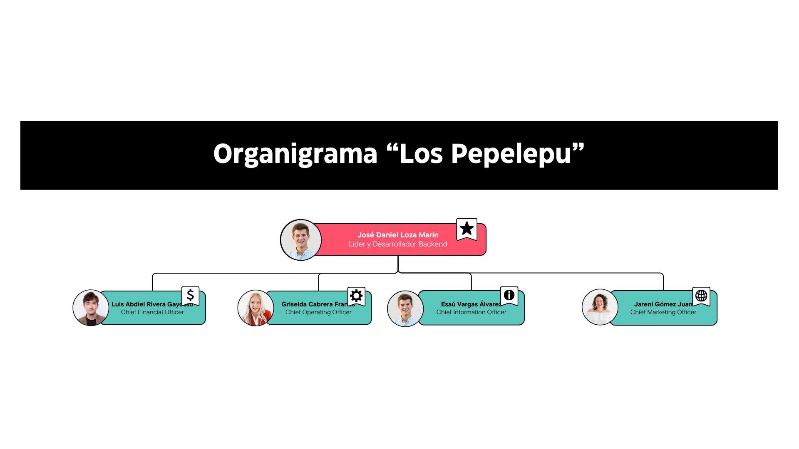
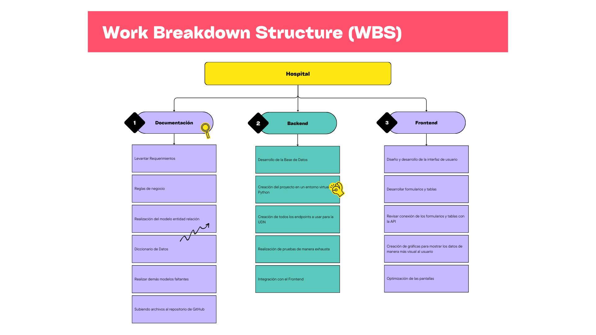

  

<h1 align="center">🧑‍💻 <strong>TI-8A-LosPepelepu-Farmacia</strong> 👩‍💻</h1>
<h3 align="center">Sistema de Gestión del Departamento de Farmacia del Hospital Las Lomas 🏥</h3>

---

## 🖼️ Logos Oficiales

<table align="center">
  <tr>
    <th>Empresa</th>
    <th>Aplicación</th>
  </tr>
  <tr>
    <td align="center"></td>
    <td align="center"></td>
  </tr>
</table>

---

## 📚 Tabla de Contenido

- [🎯 Objetivo](#-objetivo)
- [🎯 Misión](#-misión)
- [👁️ Visión](#-visión)
- [⚙️ Tecnologías Utilizadas](#-tecnologías-utilizadas)
- [✅ Funcionalidades Implementadas](#-funcionalidades-implementadas)
- [👨‍💻 Equipo de Desarrollo](#-equipo-de-desarrollo)
- [📊 Organigrama](#-organigrama)
- [🗓️ Diagrama de Gantt](#-diagrama-de-gantt)
- [📌 Estructura de Desglose del Trabajo (WBS)](#-estructura-de-desglose-del-trabajo-wbs)

---

## 🎯 Objetivo

Brindar servicios de salud de alta calidad, accesibles y humanizados, apoyándose en tecnología innovadora y personal capacitado para garantizar la seguridad y bienestar de los pacientes.

---

## 🎯 Misión

Desarrollar una plataforma moderna que permita al Departamento de Farmacia del Hospital Las Lomas gestionar sus procesos internos digitalmente, incluyendo medicamentos, lotes y consumibles, con herramientas visuales para facilitar decisiones.

---

## 👁️ Visión

Convertirse en un sistema referente dentro del hospital, escalable e integrable con otros departamentos, garantizando una gestión farmacéutica segura, ágil y confiable.

---

---

## ⚙️ Tecnologías Utilizadas

| Área       | Herramienta             |
|------------|--------------------------|
| Frontend   | Vue 3                   |
| Estilos    | CSS Puro, Bootstrap     |
| Backend    | Python                  |
| Base de Datos    | MySQL y MongoDB                  |
| Gráficas   | Gráficos personalizados |
| Arquitectura | Componentes reutilizables |

---

## ✅ Funcionalidades Implementadas

- Carrusel de medicamentos por categoría
- Modal con detalles de cada medicamento
- Gráficos analíticos interactivos
- Chatbot flotante personalizado
- Navegación y pie de página unificados
- Tarjetas animadas del equipo médico
- Gestión de lotes, consumibles y dispensación

---

|Integrante|Contacto|Rol|Observaciones|
|------------|--------|---|---|
|José Daniel Loza Marín |[@PpGrillo1511](https://github.com/PpGrillo1511)|Líder y Desarrollador BackEnd|✔️  Revisado y aprobado|
|Griselda Cabrera Franco |[@gris12eldaa](https://github.com/gris12eldaa)|Desarrollador FronEnd|❌ Sin Comentarios|
|Jareni Gómez Juan |[@jareni02](https://github.com/jareni02)|Desarrollador FronEnd|❌ Sin Comentarios|
|Luis Abdiel Rivera Gayosso |[@LuisAbdielRivera](https://github.com/LuisAbdielRivera)|Desarrollador Backend|❌ Sin Comentarios|
|Esaú Vargas Álvarez |[@Giggs007](https://github.com/Giggs007)|Desarrollador Backend|❌ Sin Comentarios|

---

## 📊 Organigrama

> Representa la estructura organizacional y los roles del equipo

  

---

## 🗓️ Diagrama de Gantt

  

---

## 📌 Estructura de Desglose del Trabajo (WBS)

  

